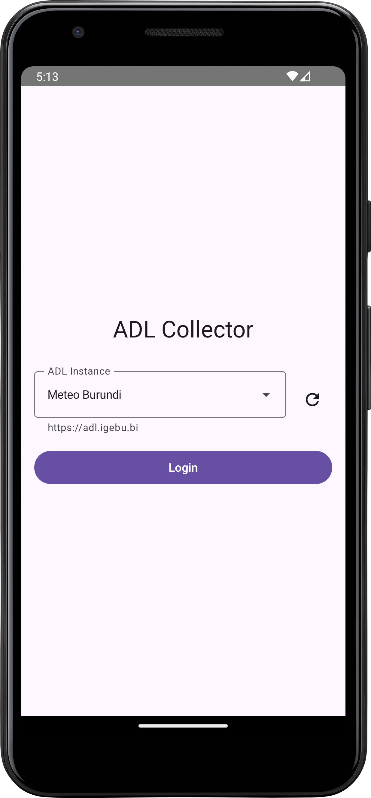

# 📱 ADL Collector

A mobile data collection app for weather stations and environmental monitoring, built for the
[Automated Data Loader (ADL)](https://github.com/wmo-raf/adl) system.

---

## ✨ Features

### 🌍 Multi-Tenant Support

* Connect to different ADL instances (Kenya, Tanzania, Uganda, etc.)
* Secure OAuth2 authentication per tenant
* Automatic tenant configuration from Firebase

### 🛰 Station Management

* View assigned weather stations
* Real-time station details and schedules
* Supports both fixed-time and windowed observation periods
* Offline-first caching for reliable access

### 📥 Data Collection

* Submit observations validated against station schedules
* Supports multiple measurement types (temperature, rainfall, etc.)
* Grace periods for late submissions
* Built-in form validation and schedule compliance checks

### 📶 Offline Capabilities

* Queue observations when offline
* Automatic sync when connectivity returns
* Local data persistence with Room database
* Background uploads with retry logic

### 📊 Observation Management

* View submission history and sync status
* Track observations (queued, uploading, synced, failed)
* Retry failed uploads
* Debug info for troubleshooting sync issues

---

## 🧩 Architecture

| Component           | Technology                   |
| ------------------- | ---------------------------- |
| **Language**        | Kotlin                       |
| **UI**              | Jetpack Compose + Material 3 |
| **Architecture**    | MVVM + Repository pattern    |
| **DI**              | Hilt                         |
| **Database**        | Room                         |
| **Networking**      | Retrofit + OkHttp            |
| **Authentication**  | OAuth2 (AppAuth)             |
| **Background Work** | WorkManager                  |

---

## 🛠 Build Requirements

* Android Studio (latest)
* Android SDK 24+
* Kotlin 2.0+

---

## ⚙️ Setup

1. Clone the repository.
2. Add your Firebase configuration file (`google-services.json`).
3. Configure tenant information in Firebase Firestore.
4. Build and install the app on your device.

---

## 📄 License

This project is licensed under the [MIT License](LICENSE).

---